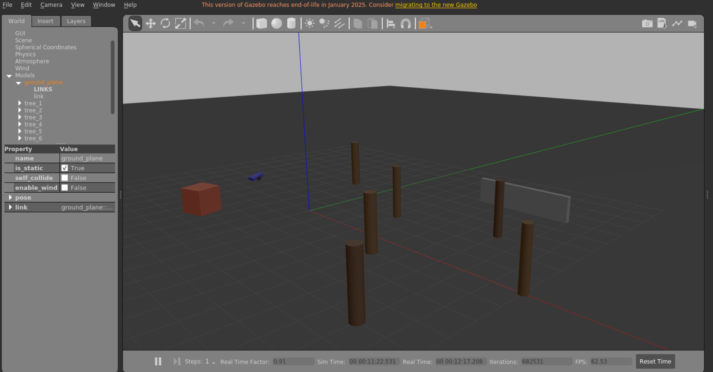
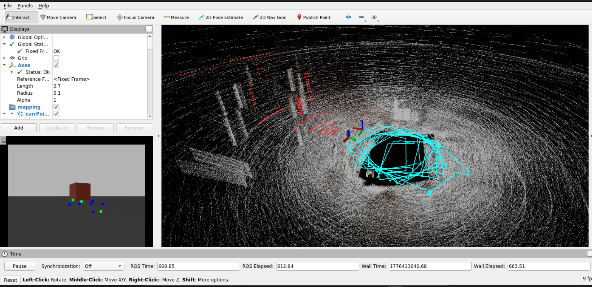
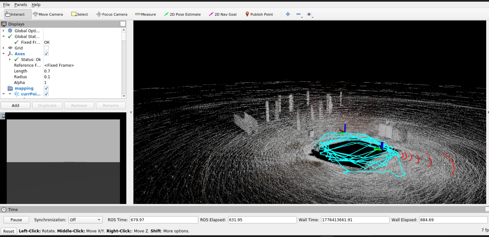
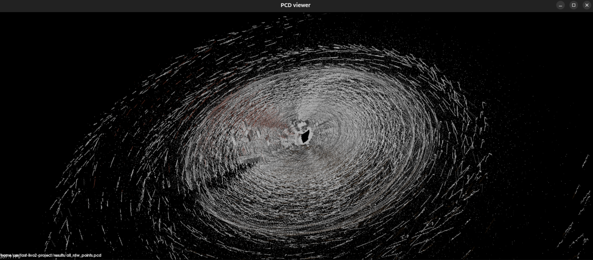

# FAST-LIVO2 + Gazebo Rover — 3D Point Cloud Mapping

## Task

Run a rover with LiDAR on PX4 + Gazebo, drive it around the map, and build a point cloud using [FAST-LIVO2](https://github.com/hku-mars/FAST-LIVO2) in RViz.

## Result

A rover with a 3D LiDAR (Velodyne VLP-16, 16 channels), a camera (640×480), and an IMU (200 Hz) drives through a map with trees and obstacles. FAST-LIVO2 builds a dense point cloud in real time, visualized in RViz.

- **Final PCD:** 79 MB raw / 2.2 MB downsampled
- **Video:** [results/Screencast drive_square.webm](results/Screencast%20drive_square.webm)
- **Point cloud (raw):** [results/all_raw_points.pcd](results/all_raw_points.pcd)

### Screenshots

<table>
<tr>
<td><br/>Gazebo — rover among the trees</td>
<td><br/>RViz — point cloud + camera</td>
</tr>
<tr>
<td><br/>RViz — top-down view of the point cloud</td>
<td><br/>PCD Viewer — final map</td>
</tr>
</table>

## Architecture

```
┌──────────────────── Docker (Ubuntu 20.04 + ROS Noetic) ─────────────────────┐
│                                                                              │
│  Gazebo 11 (forest world + rover)                                            │
│      │                                                                       │
│      ├── /velodyne_points (PointCloud2, 10 Hz) ──┐                           │
│      ├── /camera/image_raw (Image, 20 Hz)  ──────┼──→ FAST-LIVO2 (SLAM)     │
│      ├── /imu/data (Imu, 200 Hz)  ──────────────┘        │                  │
│      │                                                     ↓                 │
│      └── /cmd_vel ←── drive_square.py            /cloud_registered → RViz   │
│                                                                              │
│  PX4 SITL + MAVROS (mavros_posix_sitl.launch)                                │
│      └── /mavros/* (connected, armed via commander arm -f)                   │
│                                                                              │
└──────────────────────────────────────────────────────────────────────────────┘
```

## Tech Stack

| Component | Version | Purpose |
|---|---|---|
| Ubuntu | 20.04 (Docker) | Base OS |
| ROS | Noetic | Middleware |
| Gazebo | 11 (Classic) | 3D simulator |
| PX4 | v1.14.3 SITL | Rover autopilot |
| MAVROS | Noetic | PX4 ↔ ROS bridge |
| FAST-LIVO2 | latest | LiDAR-Inertial-Visual SLAM |
| Velodyne VLP-16 | Gazebo plugin | 3D LiDAR (16 channels, 360°) |
| Docker | 24+ | Containerization |

## Quick Start

### Requirements

- Ubuntu 22.04 / 24.04 (host)
- Docker Engine
- GPU with OpenGL support (Intel/NVIDIA/AMD)
- 8+ GB RAM (16+ recommended)
- 40 GB of free disk space

### 1. Clone the repository

```bash
git clone https://github.com/YOUR_USERNAME/fast-livo2-project.git
cd fast-livo2-project
```

### 2. Build the Docker image

```bash
docker build -t fast-livo2-img .
```

The build takes ~30–60 minutes (downloading + compiling PX4).

### 3. Run the container

```bash
./run.sh
```

### 4. Inside the container — run the simulation

**Terminal 1** — Gazebo + rover:
```bash
source /opt/ros/noetic/setup.bash
source /root/catkin_ws/devel/setup.bash
roslaunch fast_livo2_sim rover_sim.launch
```

**Terminal 2** — FAST-LIVO2 + RViz:
```bash
docker exec -it fast-livo2 bash
source /opt/ros/noetic/setup.bash
source /root/catkin_ws/devel/setup.bash
roslaunch fast_livo2_sim fast_livo2_sim.launch
```

**Terminal 3** — drive the rover:
```bash
docker exec -it fast-livo2 bash
source /opt/ros/noetic/setup.bash
source /root/catkin_ws/devel/setup.bash
python3 /root/catkin_ws/src/fast_livo2_sim/drive_square.py
```

### 5. Result

The rover will start driving in a 7×7 m square. In RViz you will see:
- Left — camera image
- Center — accumulated point cloud + rover trajectory
- Red points — current LiDAR scan

PCD files are saved automatically to `/root/catkin_ws/src/FAST-LIVO2/Log/pcd/` when FAST-LIVO2 is terminated (Ctrl+C).

## Rover Model

Custom diff-drive rover with three sensors:

- **3D LiDAR** (Velodyne VLP-16): 16 channels, 360° FOV, 10 Hz, 50 m range
- **Camera**: 640×480, 80° FOV, 20 Hz, pinhole model
- **IMU**: 200 Hz, Gaussian noise

Model: `fast_livo2_sim/models/livo_rover/model.sdf`

## Simulation World

Custom map `forest.world` with obstacles:
- 6 trees (cylinders of varying diameter)
- 1 wall
- 1 box

## PX4 Integration

PX4 SITL v1.14.3 was also tested with:
- The standard `r1_rover` model
- The standard `baylands.world` and `warehouse.world` maps
- MAVROS for the PX4 ↔ ROS link
- Arming via `commander arm -f`

### Known PX4 SITL Rover Limitations

EKF2 in PX4 SITL for the rover has convergence problems ([#18658](https://github.com/PX4/PX4-Autopilot/issues/18658), [#21229](https://github.com/PX4/PX4-Autopilot/issues/21229)):
- `Preflight Fail: High Accelerometer Bias`
- `Preflight Fail: Attitude failure (roll/pitch)`
- Caused by time desynchronization between Gazebo and PX4 (time jumps)

Arming is performed via the forced `commander arm -f` command. For stable motion control, the Gazebo `diff_drive` plugin is used instead.

## Project Structure

```
fast-livo2-project/
├── Dockerfile                          # Docker image with ROS + Gazebo + PX4 + FAST-LIVO2
├── docker-compose.yml                  # Alternative launch method
├── run.sh                              # Container launch script with GUI
├── ros_entrypoint.sh                   # Entrypoint with environment setup
├── fast_livo2_sim/                     # Simulation ROS package
│   ├── config/
│   │   ├── sim_velodyne.yaml           # FAST-LIVO2 config for simulation
│   │   └── camera_sim.yaml             # Camera parameters
│   ├── launch/
│   │   ├── rover_sim.launch            # Gazebo + rover
│   │   └── fast_livo2_sim.launch       # FAST-LIVO2 + RViz
│   ├── models/livo_rover/
│   │   ├── model.sdf                   # Rover model with sensors
│   │   └── model.config
│   ├── worlds/forest.world             # Map with trees
│   ├── drive_square.py                 # Square-driving script
│   ├── CMakeLists.txt
│   └── package.xml
├── results/
│   ├── screenshots/                    # Screenshots
│   └── all_downsampled_points.pcd      # Point cloud (downsampled, 2.2 MB)
└── docs/
    └── setup_notes.md                  # Notes on issues and solutions
```

## Issues and Solutions

### 1. Sophus fails to compile (GCC 9+)
**Error:** `lvalue required as left operand of assignment` in `so2.cpp`
**Solution:** `sed` patch in the Dockerfile — replace `unit_complex_.real() = 1.` with the constructor `std::complex<double>(1., 0.)`

### 2. PX4 SITL gazebo-classic fails to build
**Error:** `sitl_gazebo-classic-configure` failed
**Solution:** Install `libgazebo11-dev`, `libgstreamer1.0-dev`, `protobuf-compiler` before building PX4

### 3. Velodyne plugin not found
**Error:** `Failed to load plugin libgazebo_ros_velodyne_laser.so`
**Solution:** `apt install ros-noetic-velodyne-gazebo-plugins`

### 4. PX4 EKF doesn't converge on heavy maps
**Error:** `Preflight Fail: High Accelerometer Bias`
**Solution:** Use a lightweight custom map with RTF ≈ 1.0

### 5. ROS Noetic + Ubuntu 22.04/24.04
**Problem:** ROS Noetic does not support Ubuntu 22+
**Solution:** Docker container with Ubuntu 20.04

## Possible Improvements

- [ ] Autonomous navigation with obstacle avoidance (move_base / nav2)
- [ ] Colored point cloud (RGB from camera)
- [ ] More realistic map (heightmap, textures)
- [ ] Port to ROS 2 Humble + Gazebo Garden
- [ ] Fix the EKF issue for full PX4 OFFBOARD control

## References

- [FAST-LIVO2](https://github.com/hku-mars/FAST-LIVO2) — LiDAR-Inertial-Visual SLAM
- [PX4 Autopilot](https://github.com/PX4/PX4-Autopilot) — Open-source autopilot
- [FAST-LIVO2 Paper (T-RO 2024)](https://arxiv.org/pdf/2408.14035)
